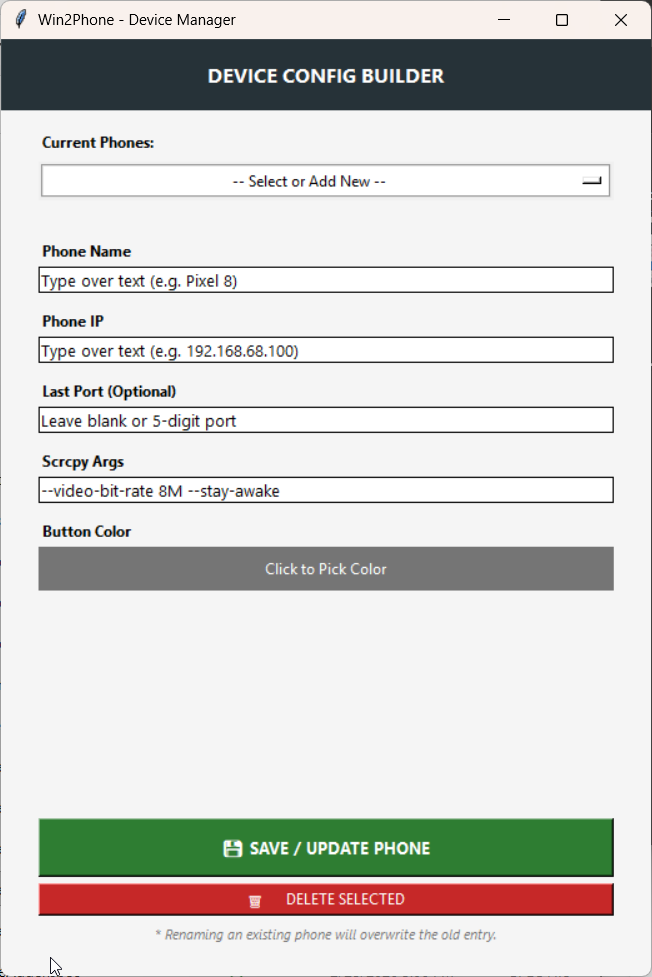
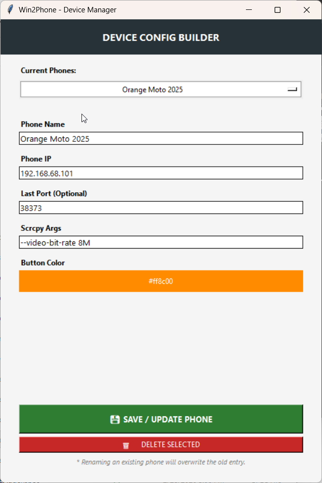

# Win2Phone: Wireless Android Management & Mirroring Guide

Win2Phone is a centralized GUI designed to manage multiple Android devices using ADB (Android Debug Bridge) and `scrcpy`. This system allows for one-time pairing, persistent device management, and optimized wireless mirroring.

---

## Section 1: Phone Preparation (Initial Setup)
Before using the software, your Android device must be configured to allow wireless communication.

### Phase 1: Enable Developer Mode
1.  On your phone, navigate to **Settings > About Phone**.
2.  Tap **"Build Number"** seven times until you see a message confirming you are a developer.
3.  Navigate to **Settings > System > Developer Options**.

### Phase 2: Configure Wireless Debugging & Tiles
1.  In **Developer Options**, switch **Wireless Debugging** to **ON**.
2.  Search for **"Quick Setting Developer Tiles"** in your phone's Settings search bar.
3.  Enable the tile for **Wireless Debugging**.
4.  **Accessing the Tile:** Swipe down twice from the top of your screen to see your quick settings. Tap the new **Wireless Debugging** tile.
5.  **Pro Tip:** Long-press this tile to instantly see your device's **IP Address and Port** needed for connection.

### Phase 3: Power & Lock Settings
1.  Search for **"Screen Lock"** in your phone settings.
2.  Adjust **"Lock after screen timeout"** to a duration that prevents the screen from going black during active mirroring sessions.

---

## Section 2: PC Environment Setup & ADB Sync
The Win2Phone app is designed to be "self-healing," but it relies on your PC having the official Android tools installed via WinGet.

1.  **Install WinGet:** Most modern Windows 10/11 systems have this by default. If not, install the "App Installer" from the Microsoft Store.
2.  **Install Google Platform Tools:** Open PowerShell and run: `winget install Google.PlatformTools`.
3.  **Install Scrcpy:** Run: `winget install Genymobile.scrcpy`.
4.  **Syncing ADB Binaries:**
    * If you open Win2Phone and see **"ADB Status: MISSING"** in the header, click the **🔄 SYNC** button.
    * The program will automatically locate the official binaries in your WinGet folder and copy `adb.exe`, `AdbWinApi.dll`, and `AdbWinUsbApi.dll` into the program directory.

---

## Section 3: Solving ADB Version Conflicts
If you encounter "unknown command" errors during pairing, an older ADB version (such as one from Touch Portal) may be hijacking your commands.
1.  **Identify Pathing Issues:** Check your system PATH to ensure the newer version is prioritized.
2.  **Direct Execution:** If necessary, navigate directly to the WinGet folder.
3.  **Force Version:** Win2Phone handles this by explicitly pointing to the `LOCAL_ADB` binaries it synchronized during setup.

---

## Section 4: Using the Win2Phone App

### 1. Adding and Editing Phones
Use the **Win2PhoneAdder.py** utility to manage your device list (`devices_config.json`).
* **Rename Sample:** On first use, rename `devices_config.json.sample` to `devices_config.json`.
* **Phone Name:** The label appearing in your list.
* **Button Color:** Assign unique colors to distinguish devices (e.g., Turquoise: `#00ced1`, Orange: `#ff8c00`).
* **Scrcpy Args:** Use `--video-bit-rate 4M --max-size 1024` for optimized performance on older devices like the **Moto G Power (2021)**.

### 2. The One-Time Pairing Handshake
Pairing is only required the very first time you connect a phone to a new PC.
1.  On the phone, tap **"Pair device with pairing code"** inside the Wireless Debugging menu.
2.  In Win2Phone, enter the **Pairing IP:Port** and **6-Digit Code** presented on the phone into the corresponding fields.
3.  Click **PAIR**. Once "Successfully paired" appears in the log, the phone is trusted forever.

### 3. Establishing the Active Connection
1.  Enable **Wireless Debugging** on your phone.
2.  Verify the **Main IP** and **Main Port** in Win2Phone match your phone's current display (this port changes frequently).
3.  Click **LAUNCH**. The button will turn red (**DISCONNECT**) while the session is active.

---

## Section 5: Advanced Customization
You can "live-tune" the interface by editing the variables at the top of **Win2Phone.py**.

### Alignment Nudging
If headers do not line up perfectly with the boxes below them, adjust the `HEADER_NUDGE` dictionary:
* **Move Right:** Increase the value (e.g., `"Main IP": 15`).
* **Move Left:** Use a negative value (e.g., `"Main Port": -10`).

### Compact Layout
Adjust the `COL_WIDTHS` list to change the spacing between elements. Lower numbers will pull the boxes closer together to fit smaller windows.

---

## Section 6: Screenshots
Visual guides for the Win2Phone interface and management utilities.

### Win2Phone Main Interface
The primary dashboard for managing and launching wireless Android mirroring sessions.

### Win2Phone Adder - New Device
The utility used to register a new Android device into your configuration.

### Win2Phone Adder - Update Device
The interface for modifying existing device nicknames, colors, or launch arguments.

---

## Maintenance & Troubleshooting
* **Clear Ghosts:** Use **🧹 CLEAR GHOSTS** to reset the ADB engine if offline devices appear in the log.
* **ADB Purge:** Use **☢️ ADB PURGE** to force-kill all stuck ADB processes tree-wide.
* **Save Changes:** Click **💾 SAVE IP/PORT TO JSON** if you manually update fields in the main window to ensure they persist after restart.