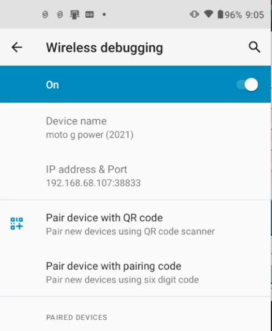

# Win2Phone: Wireless Android Management & Mirroring Guide

Win2Phone is a centralized GUI designed to manage multiple Android devices using ADB (Android Debug Bridge) and `scrcpy`. This system allows for one-time pairing, persistent device management, and optimized wireless mirroring.

You simply click on the colored button at the front of the phone list and it will load that phone screen into Windows 11 in a new window. Due to the underlying scrcpy technology, you can operate the phone almost as if you were holding it in your hand by usage of the mouse or a touchscreen. 

scrcpy is a great program but doesn't necessarily have any type of a GUI front end. The goal was to have a front end that allowed you to simply click on a button and that button would do the work of kicking off the program so it could bring up the phone screen in your PC environment. Then you can add as many buttons as you have phones. Every time you click a new phone, I do get rid of the old phone mainly because Windows has a difficult time tracking all the different ADB instances. 


## 🛠 Prerequisites: Core Tools Installation

Before running Win2Phone, you must install the following tools via **WinGet** to ensure the ADB engine and mirroring services are available on your system. In retrospect, I was updating my own version of the program and sometime in the future I may actually patch the master files so that it does a check and asks you if it needs to be downloaded. But for right now, you'll need to download it yourself. 

## Architectural overview

ADB is the magic conduit that Google created to hook up your Android phone to your PC. Specifically, it was made for developers. Most developers actually hook it up via a USB cable. However, Google did install the ability to talk to your phone wirelessly. We're going to tap into that utilizing SCRCPY on top of this to be able to bring that information back to your PC screen. 

This program simply tries to automate and present this information back to you so you can keep all the current information up to date. The key part of this is all the unique factors to be able to use SCRCPY is stored inside of a JSON file. And you can manipulate that JSON file either with the program that you select to initiate communication or with another special program that will work on the JSON file itself. 

Because this is a developer tool, it's got some downsides, even though it's very powerful. The first one is running the phone in this mode will drain your battery pretty quick. A matter of fact, simply having your phone in a mode where it can be utilized with SCRCPY is going to drain your battery.  So you may want to have this turned off on your phone and not run it all the time unless you happen to have a phone which is permanently plugged into a power source. 

To talk from your PC to your phone, you have to keep on dealing with a series of IP addresses and port numbers. To do a refresher on the technology, IP4, which is the standard by which you'll be talking to your phone, utilizes a set of four numbers separated by periods. This gives you the address of any device on your local router. Generally, it's easy to scale to around 255 devices. However, every device not only has an IP number, but it also has various ports. This is signified by a colon with a number after it. It's basically going to an address like an apartment building, and the port happens to be the individual apartment that you need to show up at. This becomes a little confusing because there are both ports for hooking up the phone initially through a process called pairing and then another port to talk to the phone on a regular basis. 

Because of security concerns, the first time a PC is introduced to a phone, you actually need to pair it. This means that you're going to get a special port on top of the phone's base IP address to be able to do a specific handshake protocol. On top of that, you'll need to put in six numbers to indicate that the PC interrogating the phone and trying to establish a relationship is the special PC with the right numbers. This turns out to only need to generally be done once when you're mating your phone with your PC. 

Now because you don't want to have this running on your phone all the time you'll be switching the ADP wireless connection on and off through a tile which is described below. Unfortunately, when you turn the tile on and off, it will change the port number every time you do this. which means that you're going to have to write down the new port number and update it inside of the program. Generally, if you're running it inside your household, which is where I think you should be running it, the IP address does not change but the port number does.

There is a workaround for the constantly shifting port number. In the companion utility, after you've entered your phone number and you confirmed everything works okay, it is possible to then select this through when to phone adder program. In this program, you can select the phone which you've connected, then attach a USB cable, and then run the button which will hard set a port number of 5555 until you reboot your phone. More details below in the text. Now it turns out there's one other benefit of this is once you've set this up as a listening port it doesn't get turned off. So even though the wireless debug may turn off through an automatic means generally it will keep this port listening and if you tickle it through the utility you'll be able to gain access to your phone. So it's another additional step, but it provides an enormous amount of utility by hooking up the USB cable. 

### 1. Install Android Platform Tools (Optional because program will check and download it if it's not installed. )

Provides the ADB engine used for pairing and wireless communication.
```powershell
winget install Google.PlatformTools
```

### 2. Install Scrcpy (Not optional because I don't do any check in the programs for scrcpy)

Provides the high-performance mirroring engine that displays your phone screen on your PC.

```powershell
winget install Genymobile.scrcpy

```
---

## Section 1: Phone Preparation (Initial Setup)
Before using the software, your Android device must be configured to allow wireless communication.

### Phase 1: Enable Developer Mode
1.  On your phone, navigate to **Settings > About Phone**.
2.  Tap **"Build Number"** seven times until you see a message confirming you are a developer.
3.  Navigate to **Settings > System > Developer Options**.

### Phase 2: Configure Wireless Debugging & Tiles
1.  In **Developer Options**, switch **Wireless Debugging** to **ON**.
2.  Search for **"Quick Setting Developer Tiles"** in your phone's Settings search bar.
3.  Enable the tile for **Wireless Debugging**.
4.  **Accessing the Tile:** Swipe down twice from the top of your screen to see your quick settings. Tap the new **Wireless Debugging** tile. You can juggle the tiles and put them in whatever position you want. Some older Android phones may not have this ability. 
5.  **Tip:** Long-press this tile to instantly see your device's **IP Address and Port** needed for connection.

### Phase 3: Power & Lock Settings
1.  Search for **"Screen Lock"** in your phone settings.
2.  Adjust **"Lock after screen timeout"** to a duration that prevents the screen from going black during active mirroring sessions.
3.  If the screen does go black, you always have the option to use your fingerprint or face to unlock it, but you'll need the physical phone to do this. 

---

## Section 2: PC Environment Setup & ADB Sync
This is a repeat of the prerequisite section, so you're going to get it again. If you've already installed it because you've read the prerequisite, then relax. You're good to go. 

1.  **Install WinGet:** Most modern Windows 10/11 systems have this by default. If not, install the "App Installer" from the Microsoft Store.
2.  **Install Google Platform Tools:** Open PowerShell and run: `winget install Google.PlatformTools`.
3.  **Install Scrcpy:** Run: `winget install Genymobile.scrcpy`.
4.  **Syncing ADB Binaries:**
    * If you open Win2Phone and see **"ADB Status: MISSING"** in the header, click the **🔄 SYNC** button.
    * The program will automatically locate the official binaries in your WinGet folder and copy `adb.exe`, `AdbWinApi.dll`, and `AdbWinUsbApi.dll` into the program directory.

Comment:  In retrospect, I just downloaded adb and the DLLs directly into the exact same subdirectory where you're running the Python script. In retrospect, it would have been cleaner to put it into its own subdirectory. Regardless, that's where it puts it. ADB is extremely fickle and making sure you have the right version and up to snuff is best. Some legacy programs may utilize ADB for some functionality and by placing it directly into the subdirectory you can make sure you have the latest greatest as I do depend upon certain functions out of the latest ADB to sync the phone. 

---

## Section 3: Solving ADB Version Conflicts
If you encounter "unknown command" errors during pairing, an older ADB version (I had a troublesome one from Touch Portal) may be hijacking your commands.
1.  **Identify Pathing Issues:** Check your system PATH to ensure the newer version is prioritized.
2.  **Direct Execution:** If necessary, navigate directly to the WinGet folder.
3.  **Force Version:** Win2Phone handles this by explicitly pointing to the `LOCAL_ADB` binaries it synchronized during setup.

---

## Section 4: Using the Win2Phone App

If you look in the subdirectory, there is a JSON file. That JSON file holds all the configuration information for the programs. And so both the master program, where you toggle on and off phones, and also a helper program that allows you to add phones in, both utilizes this exact same JSON file. I have provided a sample file and for you to be able to utilize it immediately, please remove the.sample at the end and thus it will be picked up by the Python scripts. This will give you an example of some phones that you may be able to modify or update to connect your own phone. 

### 1. Adding and Editing Phones
Use the **Win2PhoneAdder.py** utility to manage your device list (`devices_config.json`).
* **Rename Sample:** On first use, rename `devices_config.json.sample` to `devices_config.json`.
* **Phone Name:** The label appearing in your list.
* **Button Color:** Assign unique colors to distinguish devices (e.g., Turquoise: `#00ced1`, Orange: `#ff8c00`).
* **Scrcpy Args:** Use `--video-bit-rate 4M --max-size 1024` for optimized performance on older devices like the **Moto G Power (2021)**.

### 2. The One-Time Pairing Handshake
Pairing is only required the very first time you connect a phone to a new PC.
1.  On the phone, tap **"Pair device with pairing code"** inside the Wireless Debugging menu.
2.  In Win2Phone, enter the **Pairing IP:Port** and **6-Digit Code** presented on the phone into the corresponding fields.
3.  Click **PAIR**. Once "Successfully paired" appears in the log, the phone is trusted forever.

Now forever is a really big term. Really, it's going to stay trusted as long as you don't do anything major and major may be changing the ADB, it may be rebooting your phone, it may be doing anything. You'll need to make sure that you repair if for some reason it doesn't want to connect to the main phone. But this is not a function you should need to do a lot. 

### 3. Establishing the Active Connection
1.  Enable **Wireless Debugging** on your phone.
2.  Verify the **Main IP** and **Main Port** in Win2Phone match your phone's current display (this port changes frequently).
3.  Click **LAUNCH**. The button will turn red (**DISCONNECT**) while the session is active.

---

## Section 5: Advanced Customization
You can "live-tune" the interface by editing the variables at the top of **Win2Phone.py**.

I use Tkinter, and it doesn't always do exactly what I want. Therefore there's these variables up top that should allow you to nudge the text any which way if you decide to change the raw Python code. 

### Alignment Nudging
If headers do not line up perfectly with the boxes below them, adjust the `HEADER_NUDGE` dictionary:
* **Move Right:** Increase the value (e.g., `"Main IP": 15`).
* **Move Left:** Use a negative value (e.g., `"Main Port": -10`).

### Compact Layout
Adjust the `COL_WIDTHS` list to change the spacing between elements. Lower numbers will pull the boxes closer together to fit smaller windows.

---

## Section 6: Screenshots
Visual guides for the Win2Phone interface and management utilities.

#1:  This is where you'll probably spend the most of your time once you have it set up. In essence, as long as nothing misfires, you simply click any one of the buttons and it will bring up that phone into your Windows main desktop. If something does misfire, you should be looking at the tile on your phone and making sure it has the same web address and port number so the program knows and makes sure that it's communicating to the only port the phone will listen on. By the way, make sure that you're on a local Wi-Fi network, otherwise, it won't see it. 

#2:  You shouldn't need to use this section very much. Generally, you only need to pair a phone once unless something major happens, like you power cycled phone. 

#3:  This is where we check and make sure your current ADB is working correct. And as I stated in the verbiage before, if you don't have ADB, it's going to go out and pull it down. 

#4:  These are some special buttons that you can try if you have your phone registered correctly and you know you have the right web address and socket. It may be that another ADB or some interference is trying to keep your ADB from communicating correctly. If for some reason neither one of these buttons work, you'll need to reboot your machine. 

#5:  This gives you a little bit of a log as ADB goes out and tries to talk to your phone. If you have an issue, you may be able to go ahead and copy and then paste this into an LLM and say you're trying to communicate through ADB to a phone, but you got the following error message. 

### Win2Phone Main Interface
The primary dashboard for managing and launching wireless Android mirroring sessions.


### Win2Phone Adder - New Device
The utility used to register a new Android device into your configuration.  You don't actually have to use this utility. You could simply open up the JSON in a text editor and update everything. However, this provides some structure and hopefully some help for you to go and modify the JSON file. This section is on the first half of the box shown in the picture below. We will address what the USB function is in a second. 


### Win2Phone Adder - Update Device
The interface for modifying existing device nicknames, colors, or launch arguments.  Why the initial screen comes up with fields that you can type over, if you hit the pull-down box, it will pull in any phone you already have loaded inside of the JSON. After you modify something, just go ahead and save it before you bring up the main program. 


### Win2Phone Adder - USB Cable To Set 5555 as Port for Wireless

One of the frustrating things about utilizing this is that phones will turn off the wireless debug function to save battery. And when they turn it off, they change the port address so that you need to not only re-enable the phone to be able to talk to your PC, but you also need to write down the new port address. It turns out that if you are willing to attach the phone with a USB cable, you can set an alternative port address of 5555, which will map on on top of whatever is the new address it sets when you re-enable the wireless tile. 
---

## 📱 Wireless ADB Connection: The "Port 5555" Method

This project, **Win2Phone**, utilizes the "Classic ADB" wireless method to manage your devices without a physical tether. Below is a technical breakdown of how the wireless bridge is established and maintained.

##### 1. The USB Handshake (Initial Setup)

Android devices do not listen for network commands by default for security reasons. To enable wireless control, we must first "knock on the door" via a physical USB connection.

* **Command**: `adb tcpip 5555`
* **What happens**: This command tells the Android Debug Bridge (ADB) daemon on the phone to restart and listen for incoming instructions on a specific network port (5555).
* **The Result**: Once the phone responds with "restarting in TCP mode," it is ready to accept commands over your local Wi-Fi network.

##### 2. Establishing the Wi-Fi Bridge

Once the port is open, you no longer need the USB cable. You can then point your computer to the phone's local IP address (e.g., your Motorola's `192.168.68.107`).

* **Command**: `adb connect [PHONE_IP]:5555`
* **Persistence**: As long as the phone remains powered on, it will continue to listen on this port.
* **Wireless Debugging Toggle**: Because we manually set the port via USB, you do **not** need the "Wireless Debugging" toggle in Android Developer Options to be enabled for **scrcpy** to function.

##### 3. Power Consumption & Efficiency

A common concern is whether "listening" for a connection drains the battery.

* **Idle State**: Simply having Port 5555 open uses negligible CPU resources (approx. <0.5% battery per hour).
* **Active State**: Power drain only increases significantly during active streaming (e.g., using **scrcpy** at **8M bitrate**), as the phone's hardware must encode and transmit video data in real-time.

##### 4. How to Reset the Connection

Because this setting is stored in the phone's volatile memory (RAM), it is not permanent.

* **Rebooting**: Restarting the phone will automatically close Port 5555 and revert the ADB daemon to USB-only mode.
* **Manual Reset**: If you need to force the phone back to USB-only mode without rebooting, run the command `adb usb` while connected via cable.

---

> ##### 🛠️ Troubleshooting "Exit Status 1"
> 
> 
> If the `adb tcpip 5555` command fails, it is often due to multiple devices being detected (e.g., a USB device and a "ghost" emulator). In these cases, use the **Device Manager** utility to target your specific USB Serial (e.g., `ZD222RYDKQ`) using the `-s` flag.

---


---

## Maintenance & Troubleshooting
* **Clear Ghosts:** Use **🧹 CLEAR GHOSTS** to reset the ADB engine if offline devices appear in the log.
* **ADB Purge:** Use **☢️ ADB PURGE** to force-kill all stuck ADB processes tree-wide.
* **Save Changes:** Click **💾 SAVE IP/PORT TO JSON** if you manually update fields in the main window to ensure they persist after restart.