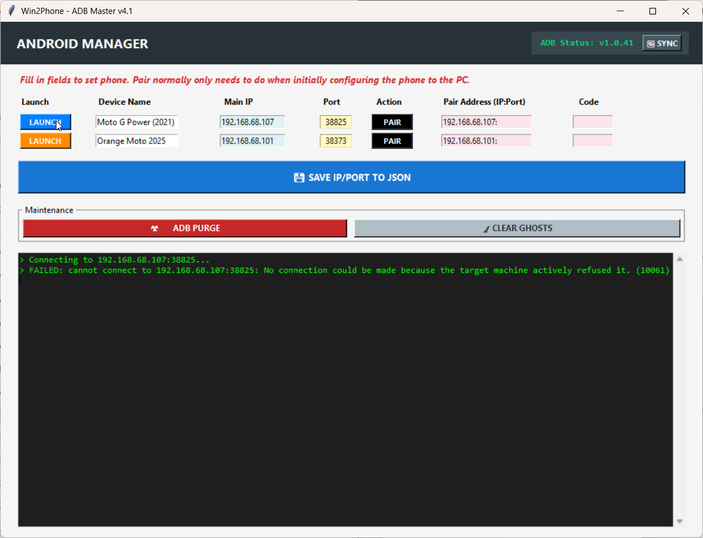
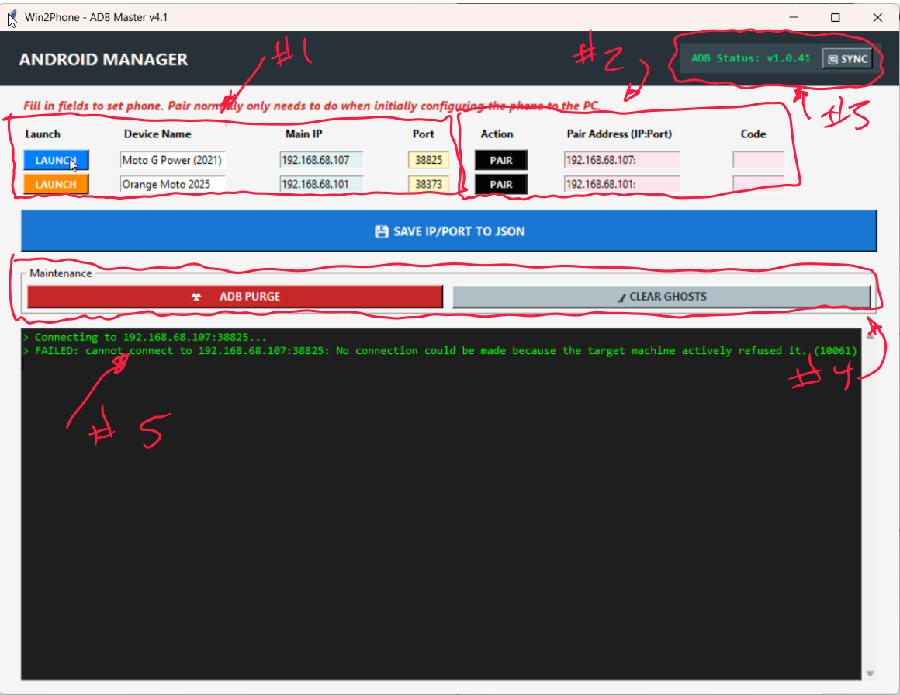
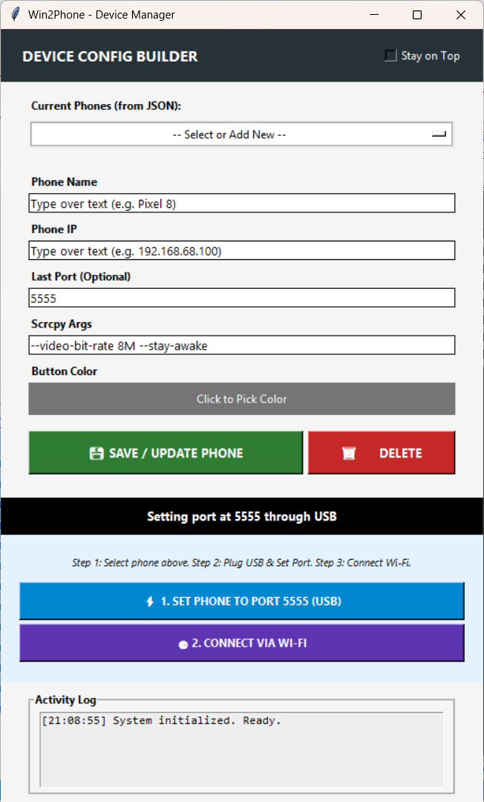
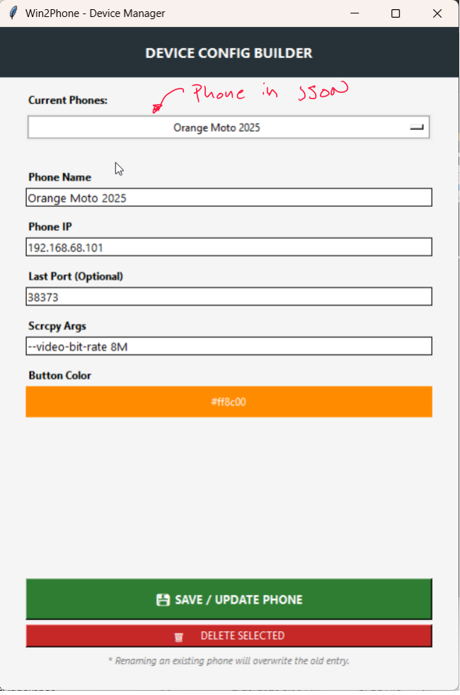

# Win2Phone: Wireless Android Management & Mirroring Guide

Win2Phone is a centralized GUI designed to manage multiple Android devices using ADB (Android Debug Bridge) and `scrcpy`. This system allows for one-time pairing, persistent device management, and optimized wireless mirroring.

You simply click on the colored button at the front of the phone list and it will load that phone screen into Windows 11 in a new window. Due to the underlying scrcpy technology, you can operate the phone almost as if you were holding it in your hand by usage of the mouse or a touchscreen. 

scrcpy is a great program but doesn't necessarily have any type of a GUI front end. The goal was to have a front end that allowed you to simply click on a button and that button would do the work of kicking off the program so it could bring up the phone screen in your PC environment. Then you can add as many buttons as you have phones. Every time you click a new phone, I do get rid of the old phone mainly because Windows has a difficult time tracking all the different ADB instances. 





## 🛠 Prerequisites: Core Tools Installation

Before running Win2Phone, you must install the following tools via **WinGet** to ensure the ADB engine and mirroring services are available on your system. In retrospect, I was updating my own version of the program and sometime in the future I may actually patch the master files so that it does a check and asks you if it needs to be downloaded. But for right now, you'll need to download it yourself. 

### 1. Install Android Platform Tools

Provides the ADB engine used for pairing and wireless communication.
```powershell
winget install Google.PlatformTools
```

### 2. Install Scrcpy

Provides the high-performance mirroring engine that displays your phone screen on your PC.

```powershell
winget install Genymobile.scrcpy

```

> **Note:** Win2Phone includes a **"Self-Healing"** feature. If the app displays "ADB Status: MISSING," use the **🔄 SYNC** button within the GUI to automatically pull the necessary binaries from these global installations into your local project folder.

---


This section clearly defines the "winget" commands needed to get the system running. Since your script specifically targets these installation paths during the sync process, having these installed first is the key to a successful setup.

Would you like me to also provide a small update for your `Win2Phone.py` file that adds a "Check Dependencies" popup to alert users if these tools are missing?

```
---

## Section 1: Phone Preparation (Initial Setup)
Before using the software, your Android device must be configured to allow wireless communication.

### Phase 1: Enable Developer Mode
1.  On your phone, navigate to **Settings > About Phone**.
2.  Tap **"Build Number"** seven times until you see a message confirming you are a developer.
3.  Navigate to **Settings > System > Developer Options**.

### Phase 2: Configure Wireless Debugging & Tiles
1.  In **Developer Options**, switch **Wireless Debugging** to **ON**.
2.  Search for **"Quick Setting Developer Tiles"** in your phone's Settings search bar.
3.  Enable the tile for **Wireless Debugging**.
4.  **Accessing the Tile:** Swipe down twice from the top of your screen to see your quick settings. Tap the new **Wireless Debugging** tile. You can juggle the tiles and put them in whatever position you want. Some older Android phones may not have this ability. 
5.  **Tip:** Long-press this tile to instantly see your device's **IP Address and Port** needed for connection.

### Phase 3: Power & Lock Settings
1.  Search for **"Screen Lock"** in your phone settings.
2.  Adjust **"Lock after screen timeout"** to a duration that prevents the screen from going black during active mirroring sessions.
3.  If the screen does go black, you always have the option to use your fingerprint or face to unlock it, but you'll need the physical phone to do this. 

---

## Section 2: PC Environment Setup & ADB Sync
The Win2Phone app is designed to be "self-healing," but it relies on your PC having the official Android tools installed via WinGet.

1.  **Install WinGet:** Most modern Windows 10/11 systems have this by default. If not, install the "App Installer" from the Microsoft Store.
2.  **Install Google Platform Tools:** Open PowerShell and run: `winget install Google.PlatformTools`.
3.  **Install Scrcpy:** Run: `winget install Genymobile.scrcpy`.
4.  **Syncing ADB Binaries:**
    * If you open Win2Phone and see **"ADB Status: MISSING"** in the header, click the **🔄 SYNC** button.
    * The program will automatically locate the official binaries in your WinGet folder and copy `adb.exe`, `AdbWinApi.dll`, and `AdbWinUsbApi.dll` into the program directory.

Comment:  In retrospect, I just downloaded adb and the DLLs directly into the exact same subdirectory where you're running the Python script. In retrospect, it would have been cleaner to put it into its own subdirectory. Regardless, that's where it puts it. ADB is extremely fickle and making sure you have the right version and up to snuff is best. Some legacy programs may utilize ADB for some functionality and by placing it directly into the subdirectory you can make sure you have the latest greatest as I do depend upon certain functions out of the latest ADB to sync the phone. 

---

## Section 3: Solving ADB Version Conflicts
If you encounter "unknown command" errors during pairing, an older ADB version (I had a troublesome one from Touch Portal) may be hijacking your commands.
1.  **Identify Pathing Issues:** Check your system PATH to ensure the newer version is prioritized.
2.  **Direct Execution:** If necessary, navigate directly to the WinGet folder.
3.  **Force Version:** Win2Phone handles this by explicitly pointing to the `LOCAL_ADB` binaries it synchronized during setup.

---

## Section 4: Using the Win2Phone App

If you look in the subdirectory, there is a JSON file. That JSON file holds all the configuration information for the programs. And so both the master program, where you toggle on and off phones, and also a helper program that allows you to add phones in, both utilizes this exact same JSON file. I have provided a sample file and for you to be able to utilize it immediately, please remove the.sample at the end and thus it will be picked up by the Python scripts. This will give you an example of some phones that you may be able to modify or update to connect your own phone. 

### 1. Adding and Editing Phones
Use the **Win2PhoneAdder.py** utility to manage your device list (`devices_config.json`).
* **Rename Sample:** On first use, rename `devices_config.json.sample` to `devices_config.json`.
* **Phone Name:** The label appearing in your list.
* **Button Color:** Assign unique colors to distinguish devices (e.g., Turquoise: `#00ced1`, Orange: `#ff8c00`).
* **Scrcpy Args:** Use `--video-bit-rate 4M --max-size 1024` for optimized performance on older devices like the **Moto G Power (2021)**.

### 2. The One-Time Pairing Handshake
Pairing is only required the very first time you connect a phone to a new PC.
1.  On the phone, tap **"Pair device with pairing code"** inside the Wireless Debugging menu.
2.  In Win2Phone, enter the **Pairing IP:Port** and **6-Digit Code** presented on the phone into the corresponding fields.
3.  Click **PAIR**. Once "Successfully paired" appears in the log, the phone is trusted forever.

Now forever is a really big term. Really, it's going to stay trusted as long as you don't do anything major and major may be changing the ADB, it may be rebooting your phone, it may be doing anything. You'll need to make sure that you repair if for some reason it doesn't want to connect to the main phone. But this is not a function you should need to do a lot. 

### 3. Establishing the Active Connection
1.  Enable **Wireless Debugging** on your phone.
2.  Verify the **Main IP** and **Main Port** in Win2Phone match your phone's current display (this port changes frequently).
3.  Click **LAUNCH**. The button will turn red (**DISCONNECT**) while the session is active.

---

## Section 5: Advanced Customization
You can "live-tune" the interface by editing the variables at the top of **Win2Phone.py**.

I use Tkinter, and it doesn't always do exactly what I want. Therefore there's these variables up top that should allow you to nudge the text any which way if you decide to change the raw Python code. 

### Alignment Nudging
If headers do not line up perfectly with the boxes below them, adjust the `HEADER_NUDGE` dictionary:
* **Move Right:** Increase the value (e.g., `"Main IP": 15`).
* **Move Left:** Use a negative value (e.g., `"Main Port": -10`).

### Compact Layout
Adjust the `COL_WIDTHS` list to change the spacing between elements. Lower numbers will pull the boxes closer together to fit smaller windows.

---

## Section 6: Screenshots
Visual guides for the Win2Phone interface and management utilities.

### Win2Phone Main Interface
The primary dashboard for managing and launching wireless Android mirroring sessions.


### Win2Phone Adder - New Device
The utility used to register a new Android device into your configuration.


### Win2Phone Adder - Update Device
The interface for modifying existing device nicknames, colors, or launch arguments.


---

## Maintenance & Troubleshooting
* **Clear Ghosts:** Use **🧹 CLEAR GHOSTS** to reset the ADB engine if offline devices appear in the log.
* **ADB Purge:** Use **☢️ ADB PURGE** to force-kill all stuck ADB processes tree-wide.
* **Save Changes:** Click **💾 SAVE IP/PORT TO JSON** if you manually update fields in the main window to ensure they persist after restart.